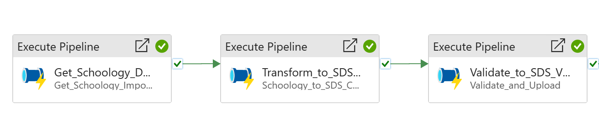
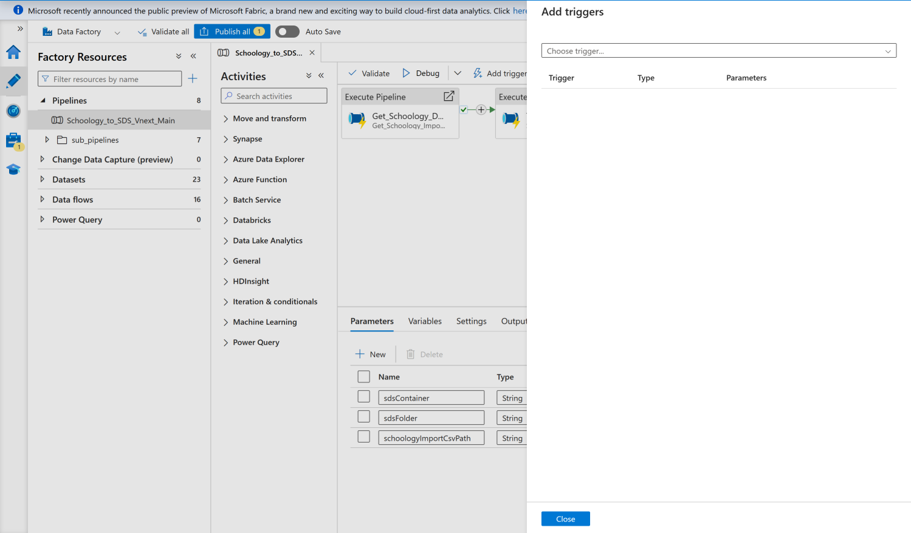
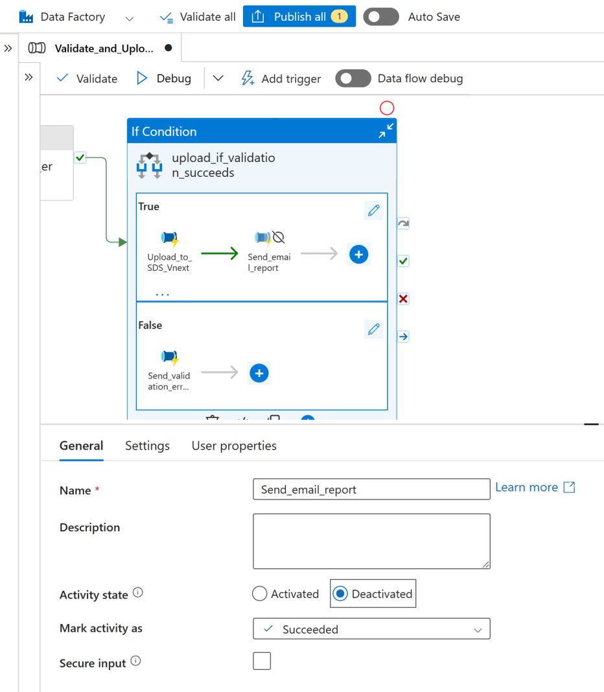
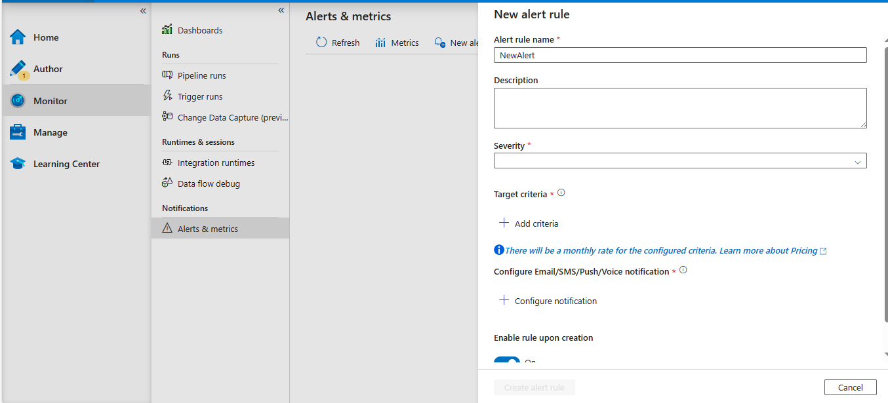
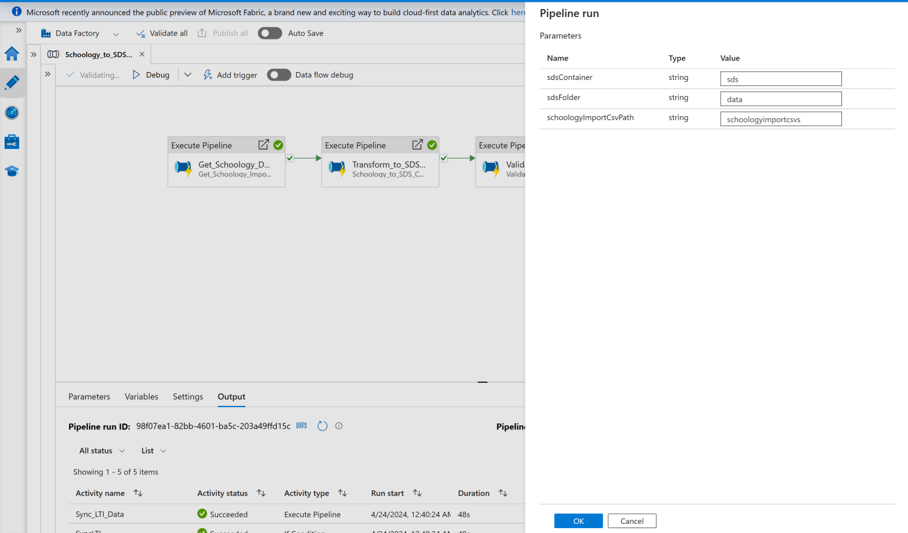
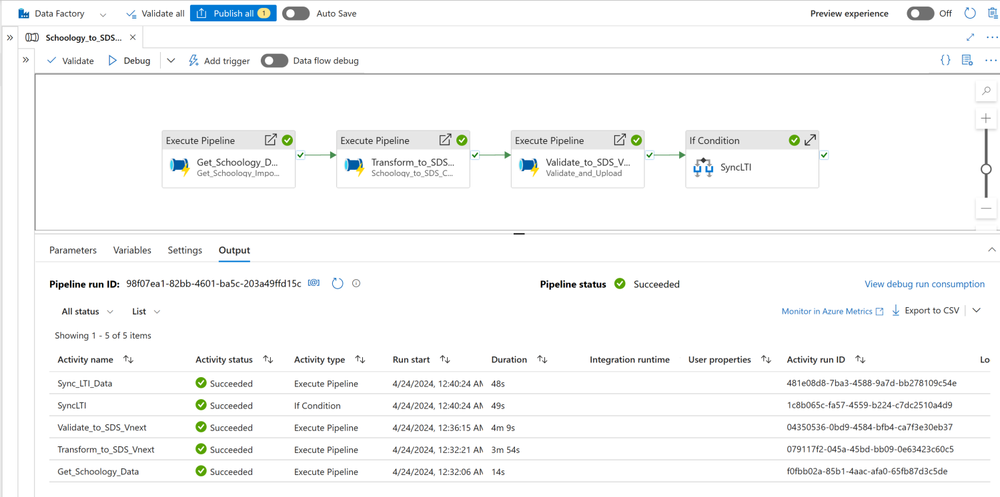

# Solution Guide: Schoology Import CSV Data ETL to SDS

[Introduction](#introduction)

[Solution Summary](#solution-summary)

- [Azure resources setup](#azure-resources-setup)

- [Data Factory setup](#data-factory-setup)

[Details of the pipelines and data flows](#details-of-the-pipelines-and-data-flows)

[Operational Guide](#operational-guide)

- [Scheduling via triggers](#scheduling-via-triggers)

- [Monitoring and Alerts](#monitoring-and-alerts)

- [Tracking cost](#tracking-cost)

[Debugging](#debugging)

[Reference Materials](#reference-materials)

# Introduction

[Microsoft School Data Sync](https://sds.microsoft.com/) is a free service in Office 365 for Education that reads the school and roster data from a school's Student Information System (SIS). It creates Office 365 Groups for Exchange Online and SharePoint Online, class teams for Microsoft Teams and OneNote Class notebooks, school groups for Intune for Education, and rostering and SSO integration for many other third-party applications. This solution leverages Azure Data Factory (ADF) to handle the daily orchestration of activities necessary to: 

- Extract data from Schoology import files and convert to SDS CSV v2.1 format. 

- Run validation on the CSV’s and remove records that don’t have required fields. 

- Upload the CSV’s to SDS and start the sync. **Note: The ADF integration will use an existing inbound flow or create a new one for you in SDS. Turn on SDS by going to** https://sds.microsoft.com **, click ‘Get Started’ then ‘Continue’ before running the ADF integration if no inbound flow exists.** 

- Send an execution notice to designated admins via email. 

This document provides a summary of the solution setup and operational info for Schoology.

# Solution Summary

## Azure resources setup

The Azure resources for this solution consist of the following:

| Resource Name         | Resource          | Description                                                                                                                                                                                                          |
| --------------------- | ----------------- | -------------------------------------------------------------------------------------------------------------------------------------------------------------------------------------------------------------------- |
| rg-SchoologyCSVtoSDS  | Resource group    | Serves as a container for the resources in this solution                                                                                                                                                             |
| adf-SchoologyCSVtoSDS | Data Factory (V2) | The data factory instance, containing the scheduled integration pipelines.                                                                                                                                           |
| kv-schoology-sds      | Key vault         | Contains the ClientSecretForSdsCsvADF key which should have the client secret created via the App Registration for the ADF instance (details further down)                                                           |
| stschoologycsvsds     | Storage account   | V2 storage account, Read-access geo-redundant storage, Encryption type: Microsoft-managed keys                                                                                                                       |
| schoologyimportcsvs   | Blob storage      | The container where the Schoology import files reside.  SFTP can be enabled on the storage account if transferring source files from outside the Azure tenant. (Note: The name is a suggestion and can be any name.) |

The setup within the Azure
subscription consists of provisioning and configuring the above resources with
following steps:

1) In the Azure portal, type "Deploy a custom template" in the search
   box

2) On the Custom Deployment page, click "Build your own template in the
   editor" to open the template editor. 

3) Load the schoologyCSV-SDS_ADF_ARM_template.json file by clicking "Load
   file" in the template editor and selecting the appropriate file to
   upload.  Create a resource group where to place the resources if not
   already done. (suggested name rg-SchoologyCSVtoSDS). Note: The optional parameters on the confirmation screen can be filled in later during the ADF setup.

4) Modify the storage account access to enable managed identity adf-SchoologyCSVtoSDS (ADF instance) to read and modify contents. (“Storage Blob Data Contributor” role). 

5) Do the same for authorized users who need to modify data in storage. Also, the user’s IP address should only be temporarily added in the firewall in the networking tab before updating the storage contents. This must be done even if the user has access control privileges.

6) If you want to use SFTP, modify the storage account access to enable managed
   identity adf-SchoologyCSVtoSDS (ADF instance) to toggle SFTP. (“Storage Account Contributor” role). The incoming IP address should also be added to firewall in the storage account.

7) Modify key vault access to enable managed identity adf-SchoologyCSVtoSDS (ADF
   instance) to retrieve secrets from the key vault (Assign “Key Vault Secrets
   User” role). [Grant
   permission to applications to access an Azure key vault using Azure RBAC |
   Microsoft Learn](https://learn.microsoft.com/en-us/azure/key-vault/general/rbac-guide?tabs=azure-portal)

8) Modify the key vault to provide access to users who need to update the secret values. (At least “Key Vault Secrets Officer” role for creating). Also, the user’s IP address should only be temporarily added in the firewall in the networking tab before updating the key vault secrets. This must be done even if the user has access control privileges.

9) Create an app registration in Entra to allow the ADF resource to call the Graph API’s needed then create a secret for the app registration. [Quickstart:
   Register an app in the Microsoft identity platform - Microsoft identity
   platform | Microsoft Learn](https://learn.microsoft.com/en-us/entra/identity-platform/quickstart-register-app)

10) Add the key vault secret values needed from the above table (Existing values were created as dummies and can be disabled). [Azure
    Quickstart - Set and retrieve a secret from Key Vault using Azure portal |
    Microsoft Learn](https://learn.microsoft.com/en-us/azure/key-vault/secrets/quick-create-portal)

11) Add the Graph API application permissions from the table below to the app
    registration.  Remember to grant admin consent for the added permissions. [Quickstart:
    Configure an app to access a web API - Microsoft identity platform | Microsoft
    Learn](https://learn.microsoft.com/en-us/entra/identity-platform/quickstart-configure-app-access-web-apis)

| **Permission**                           | **Purpose**                                             |
| ---------------------------------------- | ------------------------------------------------------- |
| IndustryData-SourceSystem.ReadWrite.All  | Create source system for SDS file upload if none exists |
| IndustryData-TimePeriod.ReadWrite.All    | Create academic year for sync if none exists            |
| IndustryData-InboundFlow.ReadWrite.All   | Upload files to SDS                                     |
| IndustryData-DataConnector.ReadWrite.All | Upload files to SDS                                     |
| IndustryData-DataConnector.Upload        | Upload files to SDS                                     |
| Mail.Send                                | Email file validation run report                        |

## Data Factory setup

1) If not already done, create a container where the Schoology import files for the ADF instance will reside (Suggest naming it "schoologyimportcsvs" within the same storage account in the newly created resource group).

2) Go to “Private endpoint connections” in the networking tab for both the key vault and storage account and approve each.  (Also verify that public access is disabled
   and there are no exceptions in “Firewalls and virtual networks”)

3) Go to the Data Factory named adf-SchoologyCSVtoSDS in Azure Portal and
   click ‘Launch studio’ to make changes. Once inside, go to the Manage tab on the left menu. 

4) The final step in the ADF setup is to configure the global parameters in the Manage
   menu as shown below, and further described in the table following.

| **Global parameter name**        | **Type** | **Description**                                                                                                                                                                                                                                                                                                                                                                                                                                                                                                                                                  |
| -------------------------------- | -------- | ---------------------------------------------------------------------------------------------------------------------------------------------------------------------------------------------------------------------------------------------------------------------------------------------------------------------------------------------------------------------------------------------------------------------------------------------------------------------------------------------------------------------------------------------------------------- |
| reportRecipientEmails            | String   | The list of email addresses to send email reports to. This needs to be entered as a json array in the following format:   [{"emailAddress":{"address":"admin@contosoisd3.onmicrosoft.com"}},{"emailAddress":{"address":"joe@contosoisd3.onmicrosoft.com"}}]                                                                                                                                                                                                                                                                                              |
| clientSecretForSdsApiKeyVaultUrl | String   | The key vault access URL for the client secret for SDS API access.  Found in the key vault resource under Secrets -> ClientSecretForSdsCsvADF -> Current Version -> Secret Identifier                                                                                                                                                                                                                                                                                                                                                                        |
| entraAppClientId                 | String   | The clientId for the app registration.  Found at Azure Active Directory -> App registrations -> *AppName*-> Overview -> Application (client) ID                                                                                                                                                                                                                                                                                                                                                                                                              |
| validationErrorThreshold         | Int      | If the number of total validation errors for a single profile exceeds this value, the data will not be sent to SDS for that profile.  [Note that the record count function has a max value of 5000, so entering a value of 5000 or greater for this setting will effectively turn off the validation threshold entirely]                                                                                                                                                                                                                                     |
| checkForEmptyFilesBeforeSending  | Bool     | This validation protects against empty files being inadvertently sent to SDS as the result of a data issue (such as an invalid header in the inbound data file).  If set to true, this validation will cause the pipeline to stop if any of the required files or All files to be sent to SDS have no records.                                                                                                                                                                                                                                               |
| tenantid                         | String   | The tenant id.                                                                                                                                                                                                                                                                                                                                                                                                                                                                                                                                                   |
| subscriptionId                   | String   | The subscription where the ADF assets are located.                                                                                                                                                                                                                                                                                                                                                                                                                                                                                                               |
| resourceGroupName                | String   | Name of the resource group which contains resources used for the ADF instance.                                                                                                                                                                                                                                                                                                                                                                                                                                                                                   |
| reportSendAsUPN                  | String   | School Data Sync Admin userPrincipalName                                                                                                                                                                                                                                                                                                                                                                                                                                                                                                                         |
| sdsInboundFlowId                 | String   | Existing SDS inbound flow id found in Sync > Configuration screen on the SDS left menu pane.  Note: Parameter value can be left as is if no sync exists.                                                                                                                                                                                                                                                                                                                                                                                                     |
| useFamilyAndGivenNames           | Bool     | Will send familyName and givenName as required for users if the option to ''Create unmatched users' is chosen in SDS (otherwise optional).  A value of false will not send familyName and givenName.                                                                                                                                                                                                                                                                                                                                                             |
| schoologyImportFileNames         | Object   | The is a mapping of the uploaded filenames used as the Schoology import files to the SDS entities.   Example:    {"orgs":"SCHOOLOGY_SCHOOLS.csv","users":"SCHOOLOGY_USERS.csv","parents":"SCHOOLOGY_PARENTS.csv","roles":"SCHOOLOGY_USERS.csv","courses":"SCHOOLOGY_COURSES.csv","classes":"SCHOOLOGY_COURSES.csv","enrollments":"SCHOOLOGY_ENROLLMENTS.csv","relationships":"PARENT_ASSOCIATIONS.csv"} Note: The value of any entity not used can be cleared from inside parenthesis (i.e. separate parents file from users, optional SDS files). |
| staffSourceIdentifier            | String   | Staff attribute based on data that is coming from your SIS / SMS. Valid values are username, email, or activeDirectory. This can be left as is if using a sync that has already been created in SDS.                                                                                                                                                                                                                                                                                                                                                             |
| staffMatchTarget                 | String   | Property in Microsoft Entra ID to match to staff. Valid values are userPrincipalName or mail. This can be left as is if using a sync that has already been created in SDS.                                                                                                                                                                                                                                                                                                                                                                                       |
| staffDomainAddon                 | String   | A valid tenant domain to append to the source value if your staff data doesn't include the @domain value. (Example: contoso.onmicrosoft.com) This can be left as is if not using appending a domain or using a sync that has already been created in SDS.                                                                                                                                                                                                                                                                                                        |
| studentSourceIdentifier          | String   | Student attribute based on data that is coming from your SIS / SMS. Valid values are username, email, or activeDirectory. This can be left as is if using a sync that has already been created in SDS.                                                                                                                                                                                                                                                                                                                                                           |
| studentMatchTarget               | String   | Property in Microsoft Entra ID to match to students. Valid values are userPrincipalName or mail. This can be left as is if using a sync that has already been created in SDS.                                                                                                                                                                                                                                                                                                                                                                                    |
| studentDomainAddon               | String   | A valid tenant domain to append to the source value if your student data doesn't include the @domain value. (Example: contoso.onmicrosoft.com) This can be left as is if not using appending a domain or using a sync that has already been created in SDS.                                                                                                                                                                                                                                                                                                      |
| yearStartDate                    | String   | Start of the academic year in yyyy-mm-dd format. This can be left as is if using a sync that has already been created in SDS.                                                                                                                                                                                                                                                                                                                                                                                                                                    |
| yearEndDate                      | String   | End of the academic year in yyyy-mm-dd format. This can be left as is if using a sync that has already been created in SDS.                                                                                                                                                                                                                                                                                                                                                                                                                                      |
| expirationDateTime               | String   | The date when SDS should stop syncing data based on the defined academic year for this source. It must not exceed the year end date. This can be left as is if using a sync that has already been created in SDS.                                                                                                                                                                                                                                                                                                                                                |

# Details of the pipelines and data flows

The main integration pipeline is Schoology_to_SDS_Vnext_Main

This pipeline utilizes sub pipelines to execute the following
steps:

1) Get data from the container which has the Schoology import files.

2) Transform Schoology data to SDS CSV v2.1 format and validate the data.

3) Upload to SDS:
   
   a.  Validate the data and write validated data to “valid” folder and write invalid data to “invalid” folder.
   
   b.  Check the number of validation errors against the validationErrorThreshold, and check that each of the csv files have data (must have at least one record in addition to the header, otherwise the assumption is that there has been an error).
   
   c.  If validation is passed, upload to SDS, start the sync, and send an email report.
   
   d. If is not passed, send a validation email report.

The validation logic is as follows:

1) Validate each of the csv files for required fields.

2) Write validation errors to validation.log, and store invalid records within the folder named “invalid.”

3) Write out the valid records for orgs.csv, users.csv, roles.csv, classes.csv, courses.csv, enrollments.csv, relationships.csv and demographics.csv in the folder named “valid.”

Note that the records in the “invalid” folder represent those records that were rejected because of missing required fields.

To get a specific list of which records were excluded due to validation, perform a diff operation between the file in the outgoing folder and the file in the “valid” folder.

**Optional Pipeline:** Toggle_Azure_Storage_SFTP can be triggered to enable SFTP for 50 minutes then disable. Schedule this before main pipeline in orderto get fresh data.

# Operational Guide

## Scheduling via triggers

Pipelines in ADF can be triggered manually as needed, or scheduled to execute based on a configured trigger ([more info on triggers here](https://docs.microsoft.com/en-us/azure/data-factory/concepts-pipeline-execution-triggers)). Triggers are managed in Manage -> Triggers and can be associated with multiple pipelines. (If triggering manually, recommend enabling “Interactive authoring” by going to Manage -> Integration runtimes -> IREastUSVNet -> Virtual Network)

To assign a pipeline to a trigger, open the pipeline and click Add trigger -> New/Edit

Suggested to use the following value for the parameter of the
main pipeline:

    schoologyImportCsvPath (Location of the Schoology import source files): schoologyimportcsvs

Note that when adding a trigger to a pipeline, you must publish the pipeline for the change to take effect.

Activities (i.e. Send_email_report) can be disabled by clicking on them and selecting Deactivated then publishing. 

## Monitoring and Alerts

Monitoring within ADF is done on the Monitor tab. More info can be found here: [Visually monitor Azure Data Factory](https://docs.microsoft.com/en-us/azure/data-factory/monitor-visually)

Alerts can be configured with Alerts & metrics -> New alert rule.

## Tracking cost

The overall cost for this integration solution is the sum of the costs for each resource within the resource group.

Within the resource group, under Cost Analysis, in the View dropdown, select Daily ADF Cost for a breakdown of the daily cost. You can click Download for an excel report with this dailybreakdown. There are several other reports that can be configured and saved
from this screen.

Note that the Data Factory resource is a “pay only for what you use” type of resource, with pricing based on pipeline orchestration and execution, data flow execution and debugging, and number of data factory operations (eg, creating/deploying pipelines, pipeline monitoring). More info on pricing can be found here: [Azure Data Factory V2 pricing](https://azure.microsoft.com/en-us/pricing/details/data-factory/data-pipeline/) 

# Debugging

Debugging within ADF is done on two levels – the pipeline level and the data flows level.

For pipelines which do not include a data flow activity, such as the Send_email_report, you can simply click on the Debug link within the pipeline view. This allows you to execute the pipeline in its current state (without publishing changes) and review the input and output of each activity within the pipeline.

To debug a data flow such as the SDSVnext_All_Files_Validation
or SDSVnext_Required_Files_Validation data flows, you have to first turn on the
“Data flow debug” setting.

More info is available here: [Mapping data flow debug mode](https://docs.microsoft.com/en-us/azure/data-factory/concepts-data-flow-debug-mode#:~:text=%20Mapping%20data%20flow%20Debug%20Mode%20%201,a%20data%20flow%20previews%20data.%20Debug...%20More%20)

# Reference Materials

| Reference                                                                                                                           | Description                                                                         |
| ----------------------------------------------------------------------------------------------------------------------------------- | ----------------------------------------------------------------------------------- |
| Homepage of Data Factory app                                                                                                        | The homepage within the app provides links to documentation, videos, and tutorials. |
| **[Azure Data Factory documentation](https://docs.microsoft.com/en-us/azure/data-factory/)**                                        | Technical reference, with links to tutorials, samples, how-to guides                |
| **[Stack overflow for ADF](https://stackoverflow.com/questions/tagged/azure-data-factory)**                                         | Developer community questions and answers on ADF                                    |
| **[MSDN forum for ADF](https://social.msdn.microsoft.com/Forums/en-US/home?forum=AzureDataFactory)**                                | Developer community questions and answers on ADF                                    |
| **[ADF videos on Channel 9](https://channel9.msdn.com/Search?term=data%20factory&pubDate=3years&lang-en=true)**                     | Short videos from Microsoft about features of ADF                                   |
| **[SDS management API](https://docs.microsoft.com/en-us/graph/api/resources/educationsynchronizationprofile?view=graph-rest-beta)** | The documentation for the management API for SDS                                    |

*The information contained in this document represents guidance on the implementation and usage of an open-sourced solution. Microsoft makes no warranties, express or implied, with the solution or this document.*
